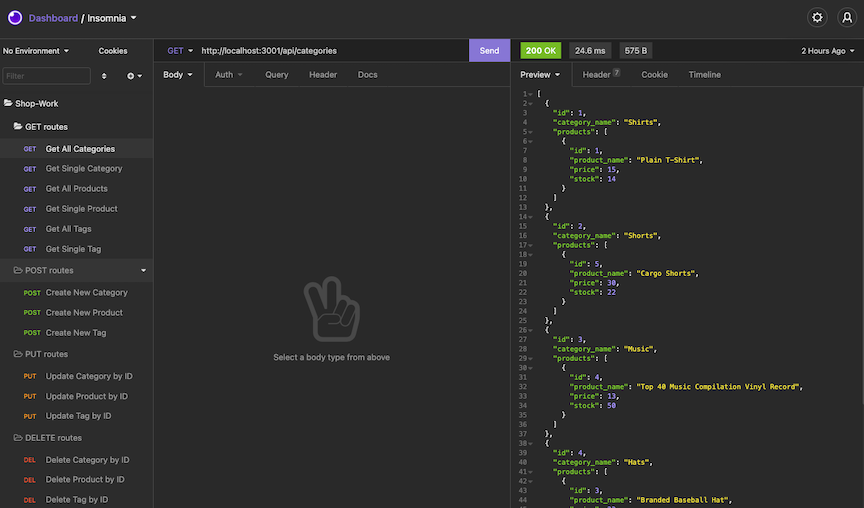

# Shop-Work : E-Commerce Back-End

  

## Description

  This application provides a framework to maintain and update an e-commerce site from the back-end. This application uses MySQL and Sequelize for trusted and efficient creation and maintenance of the database for your front-end site.

## Table of Contents

  * [Installation](#installation)
  * [Usage](#usage)
  * [Contributing](#contributing)
  * [License](#license)
  * [Questions](#questions)
  
## Installation

Follow these steps for installing this project:
1. Clone the repository to your machine
2. Navigate to the root folder of the application and open your CLI.
3. Run `npm install` for the necessary dependencies.
4. Create a `.env` file in the root folder of the application to store your MySQL username and password.
5. From the command line, enter the MySQL shell using `mysql -u root -p`.
6. Inside the MySQL shell, run `source db/schema.sql` to create the database.
7. Exit the MySQL shell (using `quit`) to return to the command line. Run `npm run seed` to populate the tables and data in the database.
8. Use the command `npm start` to start the server for testing.

## Usage

To use the application you'll navigte to the folder where the application has been cloned to your machine. Follow steps 7 and 8 from the Installation Steps to load the data and start the server. From there you can use Insomnia Core to make API requests as needed. The screenshot below shows how some of the requests will look in Insomnia Core:

## Contributing

  This application is not open to contributions at this time.

## License

  This project is licensed with MIT License.

## Questions

  If you have questions about this project please contact me at [crawleyj2@gmail.com](mailto:crawleyj2@gmail.com).
  More of my work can be found on GitHub at [crawleyj2](https://github.com/crawleyj2)

